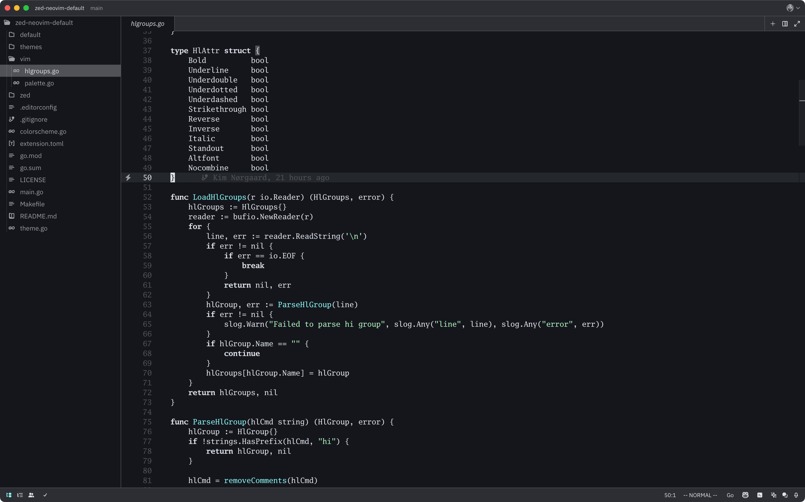
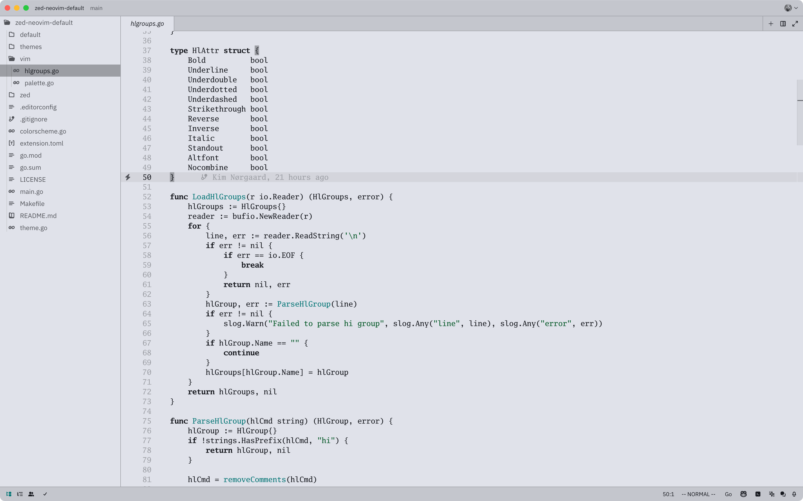
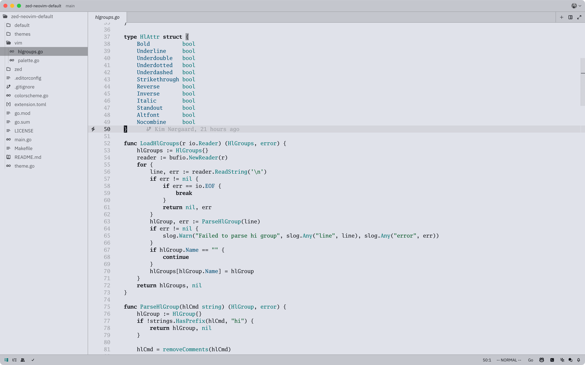

# Neovim default themes for Zed

This is a port of the default [Neovim](https://neovim.io/) themes made for the
[Zed](https://zed.dev/) editor. It uses the original palette and highlight
groups and aims to be as close to the original as possible.

I am by no means good with design and colors. Zed has a lot of UI that Neovim
doesn't and I tried to fill in the gaps while being as faithful to the original
theme as I could. Input is greatly appreciated.

Besides the original themes, I have added accented versions that are a bit more
opinionated.

## Previews

### Neovim default dark

### Neovim default light

### Neovim default dark (accented)

### Neovim default light (accented)

## Usage

### Install via Zed Extensions

It's not currently available as an extension in Zed. There is an [open
PR](https://github.com/zed-industries/extensions/pull/1733) to add it.

### Install Manually

1. `mkdir -p ~/.config/zed/themes/`
2. Copy `themes/neovim-default.json` to `~/.config/zed/themes`
3. Select one of the themes in Zed

## Development

- The original Neovim highlight groups and palette live in `default/`
- I made a go program that reads and parses those files and writes the Zed
  theme to `STDOUT`. The mapping is done in `theme.go` with some overrides in
  `main.go`. Just run `go run .` to run the program.
- Run `make build` to build the theme and write it to
  `themes/neovim-default.json`

## Contributing

Contributions are welcome! Please open an issue or submit a pull request.

## License

- [MIT](LICENSE) (for the code and derived theme)
- [Apache 2.0](./default/LICENSE.txt) (original Neovim license for the colorschemes)

### Notices

This project includes code from the following projects:

- Neovim colorschemes, licensed under the Apache License 2.0. See [LICENSE.txt](./default/LICENSE.txt) for details.

## Acknowledgements and attributions

The original colorschemes and palette can be found
[here](https://github.com/neovim/neovim/blob/master/src/nvim/highlight_group.c)
